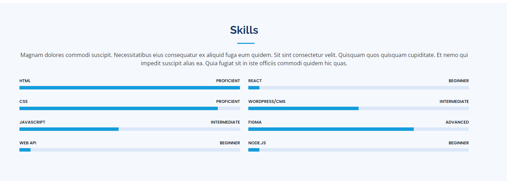

# module-03-challenge | Bootstrap Portfolio

  

 

## Table of Contents
* [Description](#description)
* [Features](#features)
* [Installation & Deployment](#installation-and-deployment)
* [Usage](#usage)
* [Credits](#credits)
* [License](#license)

 

## Description

Simple, clean and responsive html portfolio page showing all my work and knowledge acquired thus far, technologies used, as well as links to different media accounts and a downloadable resume. The page was made with bootstrap as the front-end and consists of author's background description, project experience, and contact information. More information regarding projects completed will be added in time.

 

## Features

This page features a fully responsive user interface, with working links to both existing projects, deployed and running live on github, as well as active repositories and own linkedIn page.
 

### Bootstrap

Bootstrap was used to make this website responsive. Some instances where bootstrap was used are:
 

### 1. Icons
Used specific bootstrap icons for logos like twitter, facebook, etc
TODO: PHOTO
 

### 2. Custom Bootstrap
Certain bootstrap functions have been modified to better suit this project
 

 

### 3. Bootstrap cards
Bootstrap cards displaying detailed information when hovering over them.
 

 

### 4. Animations on hover
The hyperlinks and  bootstrap cards have animations on hover
 

 

### 5. Skillset
Skill-set section has been added and it will be kept updated as I get more proficient.
 

 
### 6. Contact form

Will be developed in a future update as it requires PHP.
 

 

## Installation and Deployment

Installation not required, since this is a "plug and play" type of application. The user can simply run it locally by clicking on the "index.html" file and opening in either their default or preferred browser.

Application can also be accessed [here](https://yuehuahua.github.io/module-03-challenge/).

 

## Usage 

Simply click on the links required to be sent to the relevant piece of information.

Click on links to navigate the page \
Hover on different cards to view detailed information

 

## Credits

TODO: Add credits

 

## License

Licensed under the [MIT license](https://github.com/git/git-scm.com/blob/main/MIT-LICENSE.txt). See LICENSE for the full details.